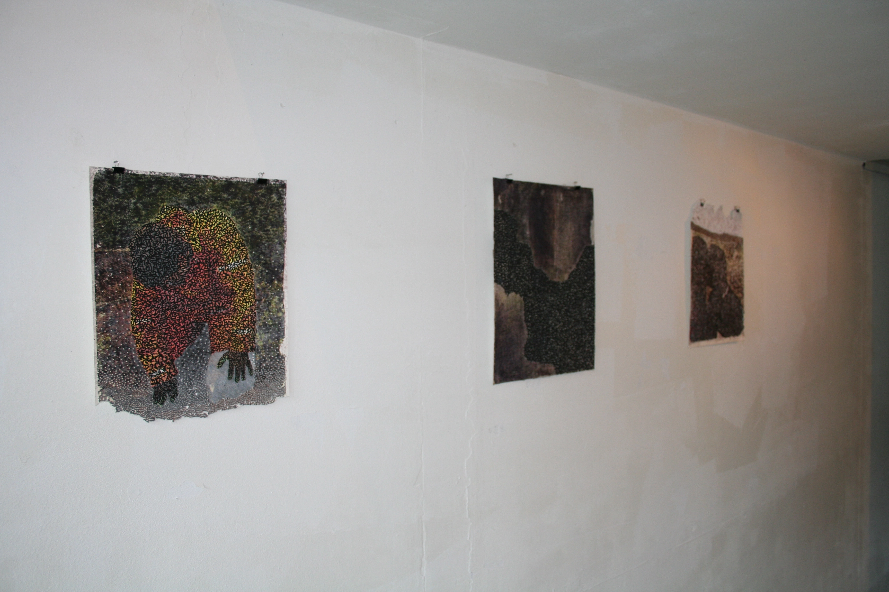
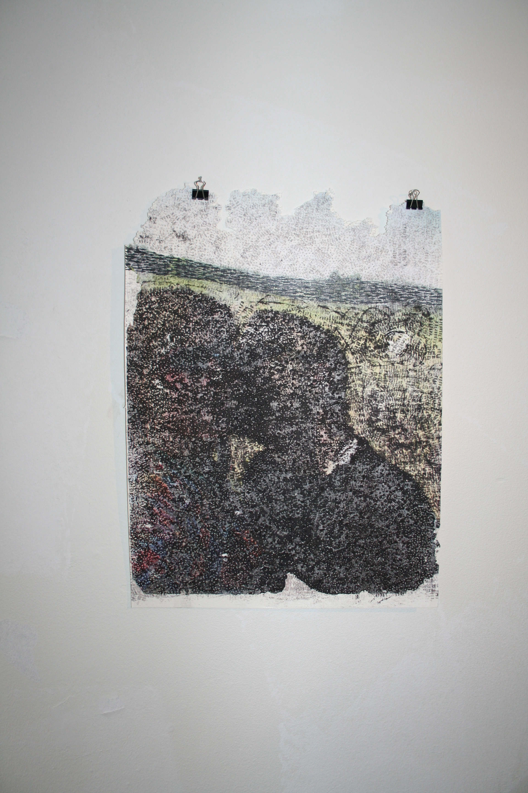
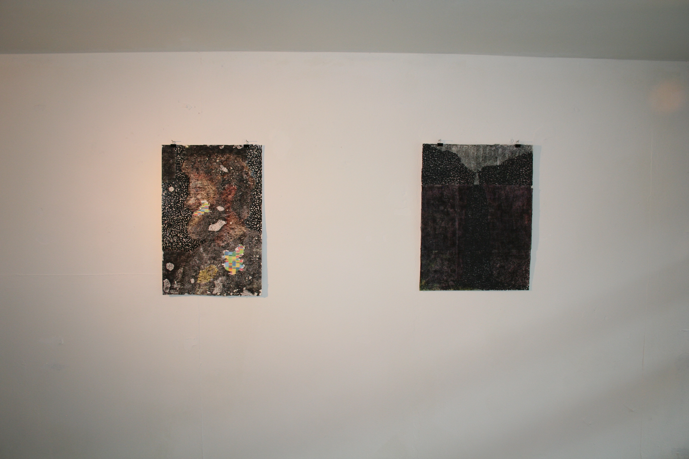
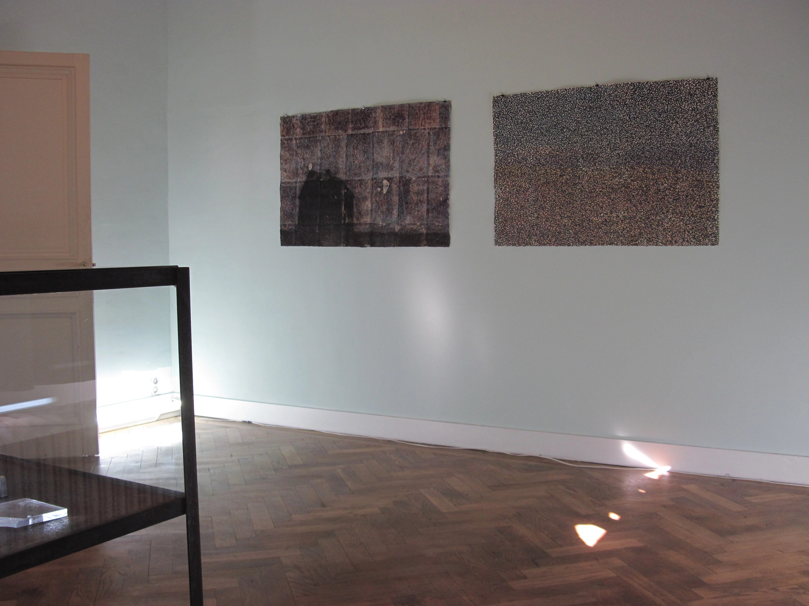
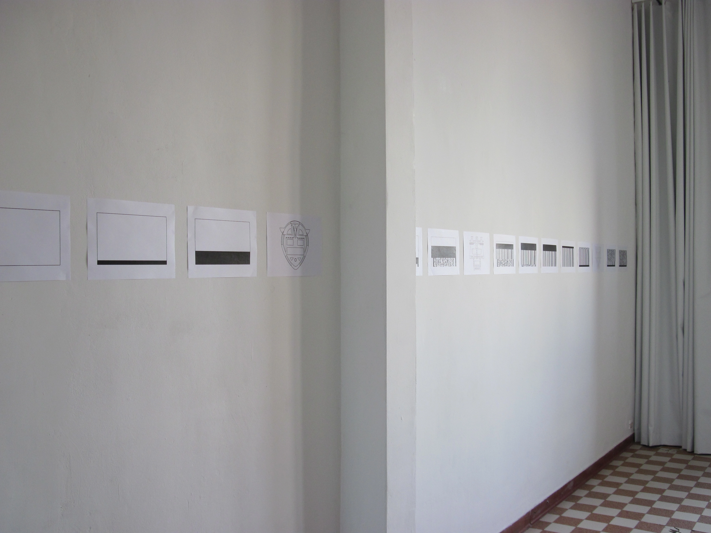
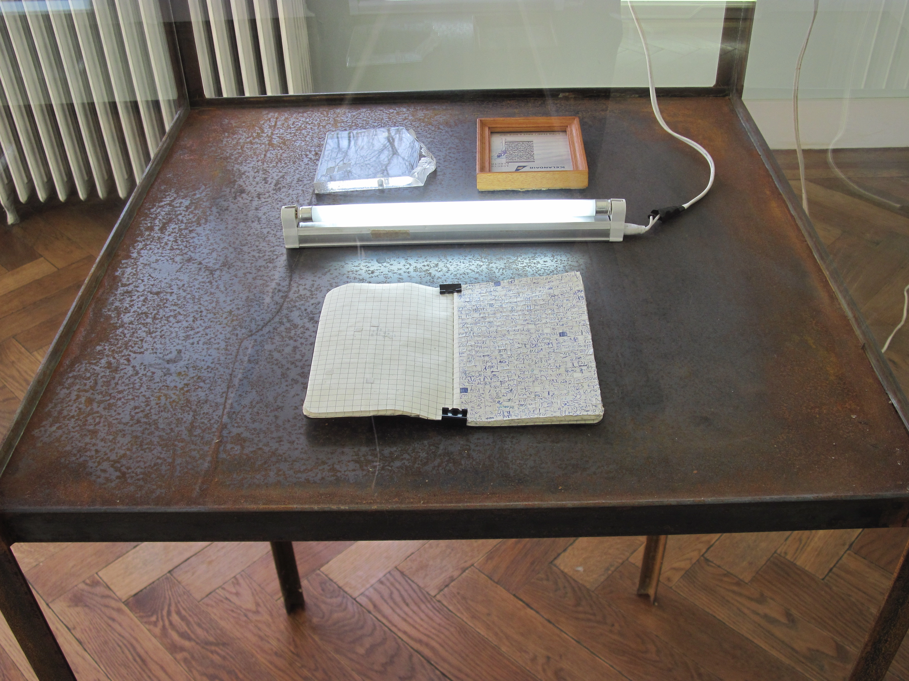
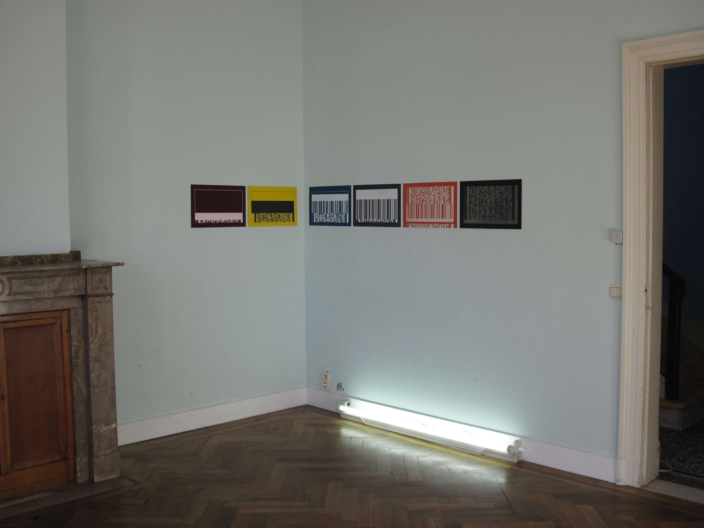

# Transfyrgi

2014

Antwerp - Hasselt, Belgium

Edited monoprints and collages on paper, laser engravings on acrylic plates and plexiglass, vector drawings on paper, notebook

*Bar codes and beyond.*

  
  
  
  
  
  
  
  
  
  

© Copyright 2026 crrmnsrg, all rights reserved.
